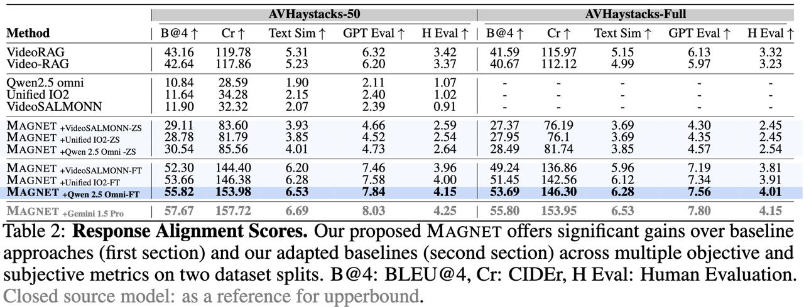

#  MAGNET: Multi-Agent Grounded Navigation for Evidence Tracking

MAGNET is a multi-agent audio-visual reasoning framework designed for temporal, causal, and multi-hop retrieval across long video haystacks. This repository contains the official implementation, datasets, evaluation metrics, and resources used in the paper.

# 🎯 Overview

MAGNET introduces a multi-agent planning + retrieval + verification pipeline enabling models to track evidence across long video sequences containing many irrelevant distractor segments (the “needle-in-a-haystack” problem).
<p align="center">  </p>


# 📦 Repository Structure
```
magnet/
│── avhaystacks/     # contains AV-Haystacks dataset + documentation
│── dataset/         # contains dataset loading, preprocessing scripts, and README
│── metrics/         # contains ll evaluation metrics with detailed explanations
```

# 🧠 MAGNET Framework
<p align="center">  </p>


# 📊 Main Results
Below is the main performance table from the paper.

<p align="center">  </p>

MAGNET significantly outperforms existing audio-visual LLMs and retrieval baselines across all haystack retrieval benchmarks.

# 📁 AV-Haystacks Dataset

The AV-Haystacks Benchmark is part of this repository under avhaystacks/.
It contains:

- 🎥 Multi-video haystacks (5–50 videos per query)
- 🗣️ Audio-conditioned and text-conditioned evidence retrieval
- 🕒 Long-range temporal grounding
- 🎯 Needle retrieval under extreme distractors
- 📝 Rich annotations and metadata

A full dataset description, annotation details, and download links are available in the subfolder README.


# 🏆 Kaggle Competition
We are releasing a public Kaggle competition based on our benchmark:

🔗 AV-Haystacks: Answer Retrieval from Multiple Videos

👉 https://www.kaggle.com/competitions/av-haystacks-answer-retrieval-from-multiple-videos/host/evaluation

Participants must retrieve correct answers from multiple long videos using multimodal signals.
Evaluation includes:

- Evidence relevance
- Temporal grounding accuracy
- Multi-hop retrieval
- Cross-video reasoning


# 🤗 Hugging Face Dataset

A compatible large-scale multimodal RAG dataset is available on HuggingFace:

🔗 Videos Dataset for LLM RAG (Audio + Video + Text)

👉 https://huggingface.co/datasets/elmoghany/Videos-Dataset-For-LLMs-RAG-That-Require-Audio-Vidoes-And-Text

This dataset can be used alongside MAGNET for:

- Video-based retrieval
- Audio-visual LLM training
- Temporal reasoning research
- Large-scale haystack experiments


# 📚 Citing MAGNET
If you find MAGNET, AV-Haystacks, or our evaluation metrics useful, please consider citing:
```
@article{chowdhury2025magnet,
  title={MAGNET: A Multi-agent Framework for Finding Audio-Visual Needles by Reasoning over Multi-Video Haystacks},
  author={Chowdhury, Sanjoy and Elmoghany, Mohamed and Abeysinghe, Yohan and Fei, Junjie and Nag, Sayan and Khan, Salman and Elhoseiny, Mohamed and Manocha, Dinesh},
  journal={arXiv preprint arXiv:2506.07016},
  year={2025}
}

```


